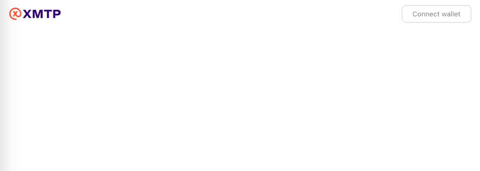
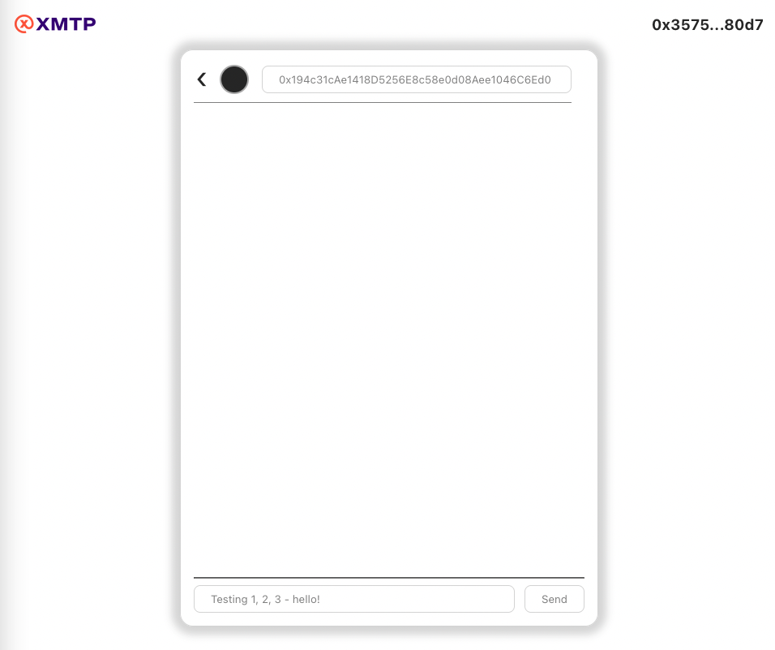

# Get started with the XMTP Quickstart React App

XMTP (Extensible Message Transport Protocol) is an open protocol and network for secure and private web3 messaging. For example, you can build an app with XMTP to provide messaging between blockchain accounts, including 1:1 chat, alerts, announcements, and more. To learn more, see [Introduction to XMTP](https://xmtp.org/docs/dev-concepts/introduction).

The XMTP Quickstart React App is an example app that you can use as a developer tool to learn how to build with XMTP.

The app provides 1:1 chat functionality and is intentionally built with lightweight code to help make it easier to parse and start learning to build with XMTP.

The app is built in React and uses the following SDK and library:

* The [XMTP JavaScript SDK](https://github.com/xmtp/xmtp-js) for communicating with the XMTP network

* The [web3modal library](https://github.com/WalletConnect/web3modal) for enabling MetaMask to connect to the app

## Prerequisites

To install and run the XMTP Quickstart React App, you must have the following prerequisites installed:

* [Node](https://nodejs.org/en/download/) (LTS version) and npm to install and run the app

* [MetaMask](https://metamask.io/) browser extension to sign in to the app

   * It's also helpful to have a basic understanding of [how the MetaMask wallet app works](https://docs.metamask.io/guide/).

* A code editor of your choice if you want to explore and build upon the app code.

## Clone the repo

For example, run:

```bash
git clone git@github.com:xmtp/xmtp-quickstart-react.git
```

## Install the app

In the root directory of `xmtp-quickstart-react`, run:

```bash
npm install
```

## Run the app

```bash
npm start
```

The XMTP Quickstart React App opens at [http://localhost:3000/](http://localhost:3000/) in your default browser.

The app is running locally and, by default, is configured to connect to the XMTP `dev` network. To learn more about the `dev` network, see [XMTP `product` and `dev` network environments](https://github.com/xmtp/xmtp-js#xmtp-production-and-dev-network-environments).



<!--- To learn how to get started building with XMTP, see Get started with building messaging between blockchain accounts using XMTP and React.-->

- For a quickstart guide to building with XMTP, see the [XMTP JavaScript SDK README](https://github.com/xmtp/xmtp-js#readme).

- To explore the example XMTP Chat App, which includes more advanced features, see the [example-chat-react app repo](https://github.com/xmtp/example-chat-react) and the [hosted example-chat-react app](https://xmtp.chat/).

Have questions or feedback?

* [XMTP Discord chat](https://discord.gg/xmtp)

* [XMTP Q&A GitHub discussion forum](https://github.com/orgs/xmtp/discussions)

## Use the XMTP Quickstart React App

1. Click **Connect wallet**.

2. The MetaMask wallet app extension appears. Select the wallet address (account) you want to use to send messages from using XMTP Quickstart React App. Click **Next**.

3. Confirm that you agree to connect your wallet address to the XMTP Quickstart React App. Click **Connect**.

4. After you've connected your wallet address to the XMTP Quickstart React App using MetaMask, you need to connect the XMTP Quickstart React App to the XMTP network. Click **Connect to XMTP**.

5. If this is your first time using an app built with XMTP, MetaMask prompts you to sign to create an XMTP identity. Creating an XMTP identity is like creating a messaging account associated with your wallet address. Click **Sign**.

6. MetaMask then prompts you to enable your XMTP identity. Enabling your XMTP identity is like entering a password to access your messaging account. Click **Sign**.

   To learn more about these signatures, see [Sign to send and receive messages using apps built with XMTP](https://xmtp.org/docs/dev-concepts/signatures).

7. The XMTP Quickstart React App is now ready for you to send a message. Click **New message** to start a new conversation.

8. Enter the full wallet address to which you want to send a message. For example, you can message **_0x194c31cAe1418D5256E8c58e0d08Aee1046C6Ed0_** to say hello to the team working on advancing the development of XMTP.

   

   To send a message to a wallet address, the wallet address must have an existing XMTP identity. For example, the controller of the wallet address must have already signed to create their identity in the same way you created an XMTP identity for your wallet address in step 5. If the wallet address does not have an XMTP identity, the **Invalid wallet** error appears.

## FAQ

### How do I add support for wallets other than MetaMask to this app?

While the XMTP Quickstart React App intentionally supports MetaMask only to keep the code lightweight, you can use XMTP with any Ethereum Virtual Machine-compatible wallet apps that support ECDSA signing on the secp256k1 elliptic curve. These include common wallet apps such as MetaMask, Coinbase Wallet, and Rainbow Wallet, as well as most wallet apps in the WalletConnect network.

For example, the XMTP Chat App, which includes more advanced features than the XMTP Quickstart React App, includes support for MetaMask, as well as Coinbase Wallet and WalletConnect.

To learn about how the XMTP Chat App provides this support, see:

- The [Wallet Connections](https://github.com/xmtp/example-chat-react/blob/c0d37c9d9c84d7b28a80a4d4ca129457bbf2c02e/README.md#wallet-connections) topic in the XMTP Chat app repo README

- The [`WalletProvider` component](https://github.com/xmtp/example-chat-react/blob/526c9dc6bbb9560023b771365f37b80a9a73a116/components/WalletProvider.tsx) in the XMTP Chat app repo

### How do I add support for ENS names to this app?

While the XMTP Quickstart React App intentionally supports full wallet addresses only to keep the code lightweight, XMTP works with any web3 identities that apps built with XMTP can derive from Ethereum accounts, such as Ethereum Name Service (ENS) names.

For example, the XMTP Chat App, which includes more advanced features than the XMTP Quickstart React App, includes support for ENS names.

To learn about how the XMTP Chat App provides this support, see [`useEns.ts` hook](https://github.com/xmtp/example-chat-react/blob/fe6c62eda312de5dd0fe0efba17d2ebb633599e6/hooks/useEns.ts) in the XMTP Chat app repo.
